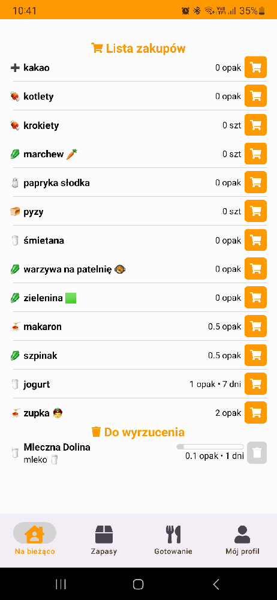
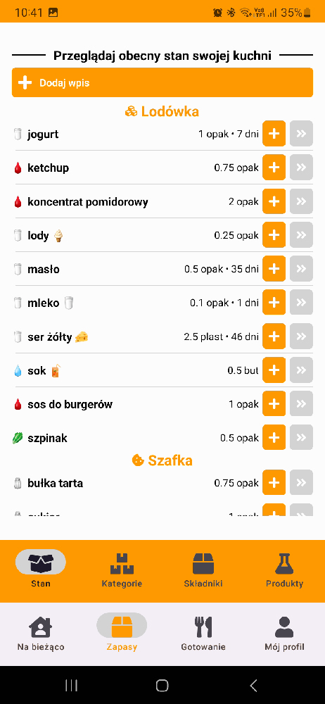
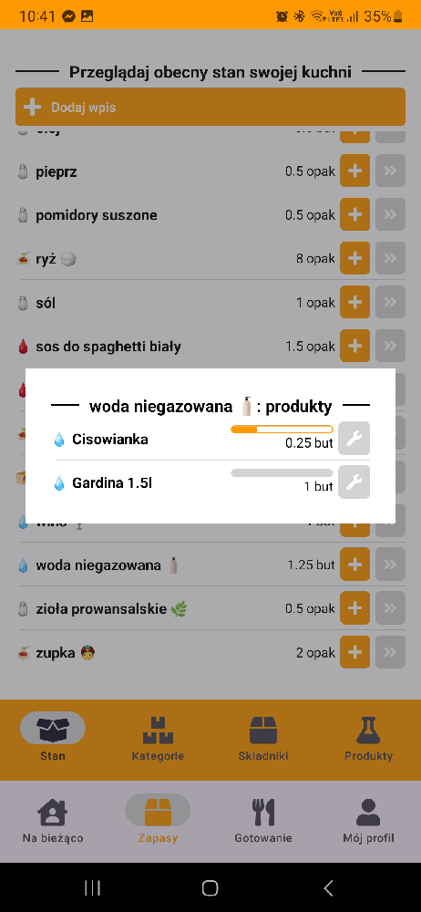
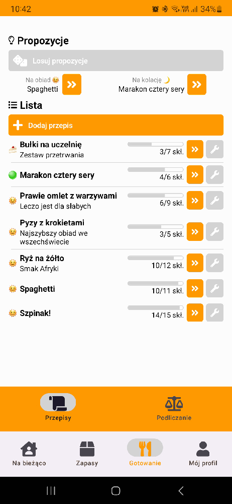

This is an assistant app for a sclerotic cook such as myself 🧑‍🍳 It manages the state of my kitchen and suggests different meals to cook 🍳 as well as creates a handy shopping list 🛒

This one is an API made in **Laravel** and maintaining a **MySQL** database. Inside you can also find a mobile app (primarily for Android) serving as the front-end, written in **React Native**. Motivation is simple – I often forget what I have in my kitchen and need something that prevents me from buying 5 packs of cheese 🧀

## Features

This app can be called a WMS of sorts. Its goal is to be quick, functional and accessible, and as such, its features include:

- 🗄️ maintaining kitchen stock with dynamic shopping list
- 📷 barcode scanner for quick product identification
- 🗑️ tracking expiry dates and notifications
- 📜 recipes adapted to current stock

## Links

This app is available at http://souschef.wpww.pl/ but it's not supposed to work for anybody, as I created it mainly for myself.

## Screenshots

## 🧑‍💻 Dev zone
This project uses node to build frontend mobile app and does not require it for backend to work properly.
- `npm run compile-frontend` - run mini powershell creator to create new version:
  - asks for new version name
  - updates that in `.json` files
  - builds the app
